# Creditra: An Algorithmic, Behavior-Priced Credit Protocol on Soroban

**Version 1.0 — June 2026**
**Contracts:** `creditra-credit` (credit-line core), `gateway-auction` (default
liquidation auction)
**Target chain:** Stellar / Soroban
**Audience:** protocol engineers, security reviewers, grant evaluators

---

## Abstract

Creditra is a decentralized credit protocol that **prices and sizes credit lines
from continuously updated on-chain behavioral signals** rather than from
overcollateralized deposits. The protocol maintains per-borrower credit lines
whose interest rate and credit limit evolve as a deterministic function of a
borrower's risk score, utilization, market risk premium, and a configurable
piecewise-linear rate formula. Default events are settled through a separate
auction contract (English or Dutch mode) using a one-shot, replay-protected
cross-contract handoff.

The protocol is implemented as two Soroban WebAssembly contracts totaling
~14.5 KLOC of Rust (`contracts/credit/src/lib.rs` alone is 5 449 lines), with
≥40 integration test files and current measured line coverage of **98.94 %**
(`COVERAGE_REPORT.md`). The credit contract's release WASM is under a hard
**50 KB CI budget** and is built with `opt-level = "z"`, full LTO, and stripped
symbols (`Cargo.toml`).

This document describes the formal credit-pricing model, the per-credit-line
state machine, the storage and event ABI, the cross-contract liquidation
handoff, the oracle circuit-breaker model, and the protocol's known limitations.
All claims are grounded in the actual source under
`contracts/credit/src/*.rs` and `gateway-contract/contracts/auction_contract/src/*.rs`
— every formula, constant, and event identifier in this paper is reproducible
from the named file and symbol.

---

## 1. Problem Statement

### 1.1 The collateral gate

Existing on-chain credit markets — Aave, Compound, MakerDAO, Liquity — require
**overcollateralization**. A borrower wanting to draw 100 USDC must first
deposit ≥ 130–150 USD of volatile collateral (ETH, LSTs, BTC). This produces
two related failure modes:

1. **Eligibility collapse.** A user who has 100 USDC of net wealth and wants to
   borrow 100 USDC against future income cannot. Empirically, the
   overcollateralized model excludes the median wallet on every chain.
2. **Capital sterility.** Collateral cannot be used productively while locked —
   it earns at most a sub-base lending APY on the very pool it secures. The
   resulting LTV-to-utilization is an inefficient store of risk-bearing capital.

Anecdotally, this is why the long tail of on-chain credit ends up routed through
unsecured social vouching (Goldfinch), credit delegation
(Aave/Spark), or structured RWA wrappers. None of these scale to the median
wallet on a public network.

### 1.2 Why this matters now

Stellar/Soroban gives the protocol primitives Ethereum lacked when Aave was
designed:

- **Cheap, predictable host environment.** Storage tiers (`Instance` /
  `Persistent` / `Temporary`) with explicit TTL budgets remove the
  unbounded-state problem that has driven so much L1 lending into stateless
  oracle relays.
- **First-class authorization (`require_auth`).** Borrower consent is verified
  at the protocol level, not via ad-hoc `msg.sender` checks.
- **Cross-contract events with structured topics.** Off-chain indexers can
  reliably reconstruct credit-line history without RPC trace heuristics.
- **Smaller surface area for upgrade.** A single admin-gated
  `update_current_contract_wasm` call (`contracts/credit/src/lib.rs:1330`)
  replaces proxy patterns and storage-rewrite migrations.

Creditra is the protocol design these primitives make possible: per-borrower,
algorithmically priced, *without* collateral as the eligibility predicate.

---

## 2. The Core Idea

### 2.1 Continuous algorithmic underwriting

A credit line in Creditra is the tuple

```
CreditLineData {
    borrower:            Address,
    credit_limit:        i128,           // signed for diff math; always >= 0
    utilized_amount:     i128,
    interest_rate_bps:   u32,            // annualized rate in basis points
    risk_score:          u32,            // 0..=100 (MAX_RISK_SCORE)
    status:              CreditStatus,   // Active|Suspended|Defaulted|Closed|Restricted
    last_rate_update_ts: u64,
    accrued_interest:    i128,
    last_accrual_ts:     u64,
    suspension_ts:       u64,
}
```

(`contracts/credit/src/types.rs:173-200`)

The two fields a credit-card issuer normally sets — `credit_limit` and
`interest_rate_bps` — are not chosen by the borrower. They are produced by a
deterministic protocol function over the borrower's measurable on-chain history
plus an off-chain risk score the admin authority writes (the data feed that
later becomes a decentralized scoring oracle; see §10).

We define:

$$
r(\text{score}) = \mathrm{clamp}\big(b + \text{score} \cdot s, \; r_{\min}, \; \min(r_{\max}, r_{\text{cap}})\big)
$$

where `b = base_rate_bps`, `s = slope_bps_per_score`, and
`r_cap = MAX_INTEREST_RATE_BPS = 10_000` (= 100 % APR), all as configured by
`set_rate_formula_config(...)`
(`contracts/credit/src/lib.rs:1159`,
`contracts/credit/src/risk.rs:77`). When the formula is disabled, the admin
supplies `interest_rate_bps` directly and the same `clamp` to `r_cap` applies.

The **credit limit** is set at origination and adjusted by
`update_risk_parameters(borrower, credit_limit, rate_bps, score)`
(`contracts/credit/src/risk.rs:207`). If the new limit is below the borrower's
current `utilized_amount`, the status transitions to `Restricted` instead of
reverting — the borrower can still repay but cannot draw, and the line
auto-cures back to `Active` on sufficient repayment
(`docs/credit.md`, see also `tests/restricted_status.rs`).

### 2.2 No overcollateralization (and the safety floor)

Creditra **does not require collateral as an eligibility predicate**. Credit is
gated by behavioral signal, not by a deposit. The protocol nevertheless exposes
an optional `MinCollateralRatioBps` (default 15 000 = 150 %) which can be
enforced at draw time
(`contracts/credit/src/lib.rs:261-424`, step 13;
`contracts/credit/src/collateral.rs:34-126`). This is the dial that an operator
can turn between "pure unsecured credit" (set ratio to 0) and "fully
collateralized like Aave" (set ratio to 15 000+). The default
configuration ships at 15 000 bps so the contract is safe to deploy in a
conservative mode and progressively loosened as scoring quality improves.

This is the key innovation surface: **the credit-extension function is a
configurable mixture of behavioral signal and capital signal, parameterized at
the protocol level, not hard-coded in the contract.**

### 2.3 Lazy, checkpoint-on-mutation accrual

Interest accrues continuously in *math*, but the contract only realizes the
accrual on a mutating call (draw, repay, status change, rate change). The model
is documented in `docs/interest-accrual.md` and implemented in
`contracts/credit/src/accrual.rs:87`:

$$
\Delta I = \left\lfloor \frac{u \cdot r \cdot \Delta t}{10\,000 \cdot \mathrm{SECONDS\_PER\_YEAR}} \right\rfloor
$$

where $u$ is `utilized_amount`, $r$ is the effective rate in bps,
$\Delta t = \text{now} - \text{last\_accrual\_ts}$, and
`SECONDS_PER_YEAR = 31_557_600` (Julian year, see
`contracts/credit/src/math_utils.rs:60`). Floor rounding favors the borrower —
the bias accumulates against protocol revenue, never against user balance — and
is enforced via the `Rounding::Floor` enum in `math_utils.rs:76`. There is no
periodic settlement cron, no keeper, no liveness assumption.

The accrual fold has three branches:

1. **Active line, current.** Rate = `interest_rate_bps`.
2. **Active line, delinquent** (past `next_due_ts + grace`). Effective rate =
   `min(rate + penalty_surcharge_bps, MAX_INTEREST_RATE_BPS)`. Emits
   `PenaltyRateEnteredEvent` on first delinquent accrual and
   `PenaltyRateExitedEvent` on cure
   (`contracts/credit/src/accrual.rs`, events at
   `contracts/credit/src/events.rs:278,296`).
3. **Suspended line under a grace policy.** Splits $\Delta t$ into
   `min(Δt, grace_seconds)` and the post-grace remainder. The in-grace portion
   is waived in `FullWaiver` mode (`GraceWaiverMode::FullWaiver = 0`) or
   charged at `reduced_rate_bps` in `ReducedRate` mode
   (`contracts/credit/src/types.rs:255-272`).

The accrual is folded into `utilized_amount` (capitalized) so subsequent
interest is compounded at the per-mutation granularity — a borrower who never
touches the line accrues simple interest; a borrower who draws frequently
compounds at draw frequency. This makes the gas-per-byte cost of accrual
**O(1) per transaction**, not O(time) like a periodic cron.

---

## 3. Behavioral Signal Taxonomy

The current contract takes `risk_score: u32 ∈ [0, 100]` as an admin-provided
scalar
(`contracts/credit/src/risk.rs:27, MAX_RISK_SCORE = 100`). The off-chain
scoring stack (out of scope for the on-chain contracts but shipped with the
protocol) computes this score from the signals enumerated below. The taxonomy
is included here so reviewers can see how the model composes; the on-chain
contract is signal-agnostic — it only sees the scalar and a cryptographic
attestation path.

| Signal class           | Source                                         | Weight class | Freshness window | Manipulation cost (intuitive) |
|------------------------|------------------------------------------------|--------------|------------------|-------------------------------|
| Wallet age             | Soroban ledger history of address              | Low          | static once observed | Free (Sybil-able) — capped weight |
| Repayment history (this protocol) | `RepaymentEvent`, `InterestAccruedEvent`, `next_due_ts` deltas | **High** | rolling 180 d | Equal to outstanding utilized × time |
| Counter-party diversity | Distinct token contracts and addresses transacted with | Medium | rolling 90 d | Linear in volume to fake |
| Stablecoin throughput   | Native-asset and SAC transfers via the Stellar token interface | Medium | rolling 30 d | Linear, observable |
| Liquidity provision     | LP positions, time-weighted | Medium | rolling 60 d | High — capital lockup |
| Off-chain attestation   | Soulbound credential / income attestation via `set_credit_attestation` (planned hook in `docs/default-oracle.md`) | **High** | per-attestation expiry | Issuer trust |
| Default / delinquency penalty | `DefaultLiquidationSettledEvent`, `("credit","pen_enter")` | **Negative-only**, never zero | sticky 24 mo | Free to incur — never to undo |
| Auction recovery rate   | `recovered_amount / utilized_amount` at settlement | Medium | per-event | N/A (post-hoc) |

The on-chain scoring oracle (specified in `docs/default-oracle.md`) is the bridge
between this taxonomy and the contract: it submits a signed
`(borrower, score, observed_at, expires_at, nonce)` envelope, the contract
verifies signature + freshness + nonce-not-used, and the score is consumed by
`update_risk_parameters`. The default oracle module is staged in
`docs/default-oracle.md` — the contract today exposes `set_oracle_config` /
`OracleConfig { max_deviation_bps, max_age_seconds }` for the *price* circuit
breaker, which is the same primitive applied to a different feed.

---

## 4. Credit Line State Machine

The credit-line lifecycle is encoded by `CreditStatus`
(`contracts/credit/src/types.rs:24-38`):

```mermaid
stateDiagram-v2
    [*] --> Draft : pre-init (no DataKey present)
    Draft --> Active : open_credit_line (admin)
    Active --> Restricted : update_risk_parameters lowers limit below utilized
    Restricted --> Active : repay_credit until utilized <= new limit
    Active --> Suspended : suspend_credit_line (admin) OR self_suspend_credit_line (borrower)
    Suspended --> Active : reinstate_credit_line (admin) [target = Active]
    Active --> Defaulted : default_credit_line (admin)
    Restricted --> Defaulted : default_credit_line (admin)
    Suspended --> Defaulted : default_credit_line (admin)
    Defaulted --> Active : reinstate_credit_line (admin, post-cure)
    Defaulted --> Restricted : reinstate_credit_line (admin, partial cure)
    Defaulted --> Closed : settle_default_liquidation (utilized reaches 0)
    Active --> Closed : close_credit_line (borrower if utilized == 0; admin always)
    Suspended --> Closed : close_credit_line (admin)
    Restricted --> Closed : close_credit_line (admin)
    Closed --> [*] : terminal
```



(Source: `contracts/credit/src/lifecycle.rs:147-666`, `docs/state-machine.md`,
event publishers in `contracts/credit/src/events.rs`.)

Properties of the state machine:

- **Capability matrix** (also in `docs/threat-model.md`):

  | State       | `draw_credit` | `repay_credit` | `update_risk_parameters` | `close_credit_line` |
  |-------------|---------------|----------------|--------------------------|---------------------|
  | Active      | yes           | yes            | yes                      | borrower if `utilized==0`, admin always |
  | Restricted  | **no** (fails `OverLimit`) | yes | yes               | admin                 |
  | Suspended   | no (`CreditLineSuspended`) | yes | yes               | admin                 |
  | Defaulted   | no (`CreditLineDefaulted`) | yes | admin only        | only via settlement   |
  | Closed      | no            | no             | no                       | idempotent (no-op)    |

- **Accrual is applied before every transition.** `apply_accrual` is called at
  the head of every state-mutating entrypoint in `lifecycle.rs` and
  `risk.rs`, so the line's `utilized_amount` reflects realized interest before
  the new state is evaluated.

- **Monotonic timestamps.** `assert_ts_monotonic`
  (`contracts/credit/src/storage.rs:538`) enforces that `suspension_ts` and
  `last_rate_update_ts` only move forward. Backdating reverts with
  `ContractError::TimestampRegression = 33`.

- **Settlement replay protection.** `settle_default_liquidation` uses a
  per-`(borrower, settlement_id)` persistent marker
  `(symbol_short!("liq_seen"), borrower, settlement_id)`. Replay reverts with
  `AlreadyInitialized`
  (`contracts/credit/src/lifecycle.rs:539-630`).

---

## 5. Risk-Pricing Formal Model

### 5.1 Rate function

Given `RateFormulaConfig { base_rate_bps b, slope_bps_per_score s, min_rate_bps r_min, max_rate_bps r_max }`
(`contracts/credit/src/types.rs:241-250`) and a borrower's `risk_score k`:

$$
r(k) = \mathrm{clamp}(b + k \cdot s, \; r_{\min}, \; \min(r_{\max}, 10\,000))
$$

The implementation is `compute_rate_from_score` at
`contracts/credit/src/risk.rs:77` using **saturating** arithmetic, so a
misconfigured `b + 100·s` cannot overflow `u32` — it saturates and is then
clamped.

If a per-borrower floor exists (`DataKey::RateFloorBps(Address)`,
`contracts/credit/src/storage.rs:357`), it is applied as a final lower bound:

$$
r_{\text{effective}}(k) = \max(r(k), \; r_{\text{floor}}(\text{borrower}))
$$

Rate-change cadence is gated by `RateChangeConfig { max_rate_change_bps, rate_change_min_interval }`
(`contracts/credit/src/types.rs:217-222`,
`Symbol("rate_cfg")` instance key). A rate update reverts with
`RateTooHigh` if the absolute delta exceeds `max_rate_change_bps` and with
`TimestampRegression` if it falls inside `rate_change_min_interval` seconds of
the prior update.

### 5.2 Limit function

`update_risk_parameters` accepts an admin-supplied `credit_limit` that is
validated against the protocol-wide bounds `(MinCreditLimit, MaxCreditLimit)`
(`contracts/credit/src/lifecycle.rs:78-145`) and against the per-borrower
exposure cap. The function does **not** algorithmically derive
`credit_limit` from `risk_score` today — it accepts the admin/oracle's value
and validates. The composition of an off-chain scoring function with the
on-chain `update_risk_parameters` call is the model:

$$
\ell(\text{borrower}) = \mathrm{clip}\Big(\ell_{\text{base}} \cdot f(k, h, a), \; \ell_{\text{min}}, \; \ell_{\text{max}}\Big)
$$

where $h$ is the borrower's history vector (repayments, recoveries) and $a$ is
the attestation bundle (income proof, employer attestation, etc.). The
multiplicative form lets the oracle express *recovery probability* as a single
factor: a borrower with a high default-recovery rate gets a multiplier > 1, a
borrower with sticky penalties (cf. §3) gets a multiplier < 1.

### 5.3 Interest accrual closed form

Per-call accrual (`contracts/credit/src/accrual.rs:87`):

$$
\Delta I = \left\lfloor \frac{u \cdot r_{\text{eff}} \cdot \Delta t}{10\,000 \cdot 31\,557\,600} \right\rfloor, \quad \Delta t = \text{now} - t_{\text{last}}
$$

Capitalization rule:

$$
u' = u + \Delta I, \quad I_{\text{accrued}}' = I_{\text{accrued}} + \Delta I, \quad t_{\text{last}}' = \text{now} \cdot [\Delta I > 0]
$$

(Note: `t_last` is only advanced when `ΔI > 0` to avoid silently zeroing out
sub-tick accrual on chains with sub-second ledger close times. See
`docs/interest-accrual-design.md` and the test `tests/monotonic_timestamps.rs`.)

For suspended lines with a grace policy, the split is:

$$
\Delta t_g = \min(\Delta t, T_g), \quad \Delta t_p = \Delta t - \Delta t_g
$$

$$
\Delta I = \begin{cases}
\mathrm{prorate}(u, r_{\text{eff}}, \Delta t_p) & \text{if FullWaiver} \\
\mathrm{prorate}(u, r_{\text{reduced}}, \Delta t_g) + \mathrm{prorate}(u, r_{\text{eff}}, \Delta t_p) & \text{if ReducedRate}
\end{cases}
$$

### 5.4 Repayment allocation

`repay_credit` allocates a repayment $a$ as
**interest-first, then principal, then protocol fee**
(`contracts/credit/src/lib.rs:437-556`):

$$
a_{\text{eff}} = \min(a, u)
$$

$$
a_I = \min(a_{\text{eff}}, I_{\text{accrued}}), \quad a_P = a_{\text{eff}} - a_I
$$

$$
\text{fee} = \left\lfloor \frac{a_I \cdot \phi}{10\,000} \right\rfloor, \quad a_{\text{reserve}} = a_{\text{eff}} - \text{fee}
$$

where $\phi$ is `protocol_fee_bps` (capped at `MAX_PROTOCOL_FEE_BPS = 1_000` =
10 % of *interest*, never principal — `contracts/credit/src/lib.rs:63`). The
fee is `transfer_from(borrower, contract, fee)`; the reserve portion is
`transfer_from(borrower, liquidity_source, a_reserve)`. Treasury fees require
an admin proposal followed by confirmation after a fixed 24-hour delay.

---

## 6. Default & Liquidation

### 6.1 Two-phase handoff

Creditra does not embed an auction in the credit contract. Default settlement
is a **two-contract handoff**:

1. **Default signal.** `default_credit_line(borrower)` is called by admin
   (today; an oracle-driven path is staged in `docs/default-oracle.md`). The
   credit line transitions `Active|Restricted|Suspended → Defaulted`. An event
   `("credit", "liq_req")` is emitted with the outstanding amount
   (`contracts/credit/src/events.rs:236`).

2. **Off-chain auction orchestration.** An off-chain orchestrator (or, in a
   later version, a permissionless keeper) observes the `liq_req` topic,
   constructs an auction on the `gateway-auction` contract via
   `init_auction(auction_id, mode, start_time, end_time, min_bid, min_increment_bps, dutch_start_price, dutch_floor_price)`
   (`gateway-contract/contracts/auction_contract/src/lib.rs`).

3. **Settlement.** Once the auction closes, an admin call to the credit
   contract's
   `settle_default_liquidation(borrower, recovered_amount, settlement_id, oracle_price)`
   (`contracts/credit/src/lib.rs:953`) cross-contract calls the auction's
   `settle_default_liquidation(auction_id, credit_contract, borrower) -> i128`
   and **asserts the returned amount matches the supplied `recovered_amount`**.
   If they diverge, the call reverts with `InvalidAmount`.

The cross-contract call is reentrancy-guarded on both sides
(`storage::set_reentrancy_guard` /
`storage::clear_reentrancy_guard`,
`Symbol("reentrancy")` in instance storage). Settlement is one-shot per
`(borrower, settlement_id)` on the credit side and per `auction_id` on the
auction side (`AuctionKey::LiquidationSettled(Symbol)`).

### 6.2 English vs Dutch mode

`AuctionMode` is set at auction init
(`gateway-contract/contracts/auction_contract/src/types.rs`):

- **English (ascending, open).** `min_next_bid = max(highest_bid * (1 + min_inc_bps/10_000), highest_bid + 1)`
  (`gateway-contract/contracts/auction_contract/src/lib.rs`, helper
  `min_next_bid`). Previous bidder is **atomically refunded** under the
  reentrancy guard; the refund emits `BidRefundedEvent` on topic
  `("BID_RFDN", auction_id)`. The auction closes when the admin invokes
  `close_auction` after `now >= end_time`.

- **Dutch (descending).**
  $p(t) = p_0 - (p_0 - p_f) \cdot t / T$ for $t \in [0, T]$, clamped to $p_f$.
  Implemented in `compute_dutch_price(start, floor, elapsed, duration)`. The
  first bid `amount ≥ p(t) ∧ amount ≥ min_bid` immediately closes the auction.

### 6.3 Anti-snipe (and disclosure)

The auction module's docstring describes an anti-snipe extension where bids
within an extension window push out the close time. The constant
`ANTI_SNIPE_WINDOW_SECS` / `ANTI_SNIPE_EXTEND_SECS` is referenced in
PR #430's description (`feature/auction-anti-snipe`); after the
merge-with-overlapping-`AUCTION_CLOSE_TIME_FIX.md` reconciliation, the live
`place_bid` path hard-rejects bids when `now >= end_time` without extending
(see `docs/SECURITY.md` "Known gaps"). This is tracked as an open item in
`docs/EXECUTION_QUALITY.md`.

### 6.4 Recovery accounting

`settle_default_liquidation` (in `lifecycle.rs`) clips `recovered_amount` to
the borrower's outstanding `utilized_amount`, decrements both
`utilized_amount` and `accrued_interest` pro-rata to interest-vs-principal,
adjusts `TotalUtilized`, and — if `utilized_amount` reaches 0 — automatically
transitions the line to `Closed` and clears the repayment schedule. The event
`DefaultLiquidationSettledEvent` is emitted with the full settlement breakdown
(`contracts/credit/src/events.rs:242`, schema in `docs/indexer-integration.md`).

---

## 7. Oracle Architecture

The protocol uses two oracle surfaces:

### 7.1 Price oracle (live)

`set_oracle_config(max_deviation_bps, max_age_seconds)`
(`contracts/credit/src/lib.rs:1055`). On every `settle_default_liquidation`
call with an oracle config present:

1. The supplied `oracle_price` must be > 0 (else `OraclePriceInvalid = 36`).
2. `now - last_price_ts <= max_age_seconds` (else `OraclePriceStale = 37`).
3. Deviation in bps from the last accepted price must be
   `<= max_deviation_bps` (else `OraclePriceDeviation = 38`).
4. The new price and timestamp are persisted **atomically** to
   `(OracleLastPrice, OracleLastPriceTs)` in instance storage — there is no
   intermediate state where one is updated without the other
   (`contracts/credit/src/storage.rs:561-593`).

Deviation is computed by `math_utils::compute_deviation_bps`
(`contracts/credit/src/math_utils.rs:306`): returns `None` when
`last_price <= 0`; saturates output at `u32::MAX` so an absurd new price still
trips the breaker. Manipulation cost (informal): an attacker who controls a
fraction `f` of oracle reports must move the price by
`max_deviation_bps / 10_000 · last_price` within `max_age_seconds` *and*
pay the gas to push that update through the deviation gate on every block. The
breaker bounds the per-block price move by the configured threshold.

### 7.2 Default-signal oracle (staged in `docs/default-oracle.md`)

A signature-verified attestation envelope
`(borrower, reason_code, observed_at, expires_at, nonce, chain_id, contract_id)`
that, when valid, lets a `default_credit_line` call originate from an oracle
rather than the admin. Phase 1 (admin-assisted): the signal is persisted at
`PendingDefaultSignal(borrower)` and the admin then calls `default_credit_line`
within a freshness window. Phase 2 (permissionless): a
`default_credit_line_with_signal` entrypoint accepts the signal directly.

Storage layout for the planned module (in `docs/default-oracle.md`):
`OracleSignerSet` (instance), `UsedSignalNonce(borrower, nonce)` (persistent),
`PendingDefaultSignal(borrower)` (persistent). Nonce reuse reverts with
`AlreadyInitialized`.

---

## 8. Comparison Table

| Property                          | Aave v3                          | Compound v3                       | MakerDAO Spark                    | **Creditra**                     |
|-----------------------------------|----------------------------------|-----------------------------------|-----------------------------------|----------------------------------|
| Eligibility predicate             | Deposit ≥ LTV-cap × loan         | Deposit ≥ LTV-cap × loan          | Deposit ≥ LTV-cap × loan (Vault)  | Behavioral score + optional collateral floor |
| Collateralization ratio (default) | 125–166 %                        | 130–150 %                         | 150 %+                            | 0 % (default unsecured) / 150 % (default-on optional collateral) |
| Median user eligibility           | Excludes wallets w/o LTV-capable assets | Same                          | Same                              | Includes wallets with on-chain behavioral history |
| Pricing input                     | Utilization curve                | Utilization curve                 | Stability fee (governance)        | Behavioral risk score + utilization + market premium |
| Settlement of bad debt            | Keeper-driven liquidation w/ bonus | Keeper-driven                  | Vault auction                     | Cross-contract English / Dutch auction with replay-safe handoff |
| Settlement speed                  | Single-tx liquidation            | Single-tx                         | Auction window                    | Auction window (configurable) — accounting is single-tx |
| Recovery rate assumption          | LTV × liquidation bonus          | LTV × liquidation bonus           | Auction discount                  | Empirical from `recovered_amount / utilized_amount` |
| Interest model                    | Per-block accrual                | Per-block accrual                 | Per-stability-fee                 | Lazy checkpoint, capitalized on mutation |
| Upgrade model                     | Proxy + governance               | Governance migrations             | Module replacement                | Admin-gated atomic `update_current_contract_wasm` + version bump |
| Event schema for indexers         | Solidity events                  | Solidity events                   | Solidity events                   | Stable Soroban topics, see `docs/indexer-integration.md` |
| WASM / bytecode size              | N/A (Solidity, ≥ 30 KB per facet) | N/A                              | N/A                               | **< 50 KB hard CI budget** (`creditra-credit.wasm`) |
| Test coverage                     | varies                            | varies                            | varies                            | 98.94 % lines / 99.51 % regions |

---

## 9. Implementation Quality (a slice)

A reviewer who skims the repo should look for:

- **5 449-line `lib.rs` with one `#[contractimpl]` block**
  (`contracts/credit/src/lib.rs`). 13 sub-modules
  (`accrual, auth, borrow, collateral, config, events, freeze, lifecycle, math_utils, query, risk, storage, types`).
- **38 enumerated `ContractError` variants** with stable discriminants
  (`contracts/credit/src/types.rs:91-168`). CI test
  `tests/error_discriminants.rs` reverts if any discriminant moves.
- **30 enumerated `DataKey` variants** with explicit storage tier per variant
  (`contracts/credit/src/storage.rs:31-98`,
  documented in `docs/storage-layout.md`).
- **25+ unique event topics** under the `credit` namespace
  (`contracts/credit/src/events.rs`, cataloged in
  `docs/indexer-integration.md`). Event payload structs are `#[contracttype]`
  and the topic strings are `symbol_short!`-compatible (≤ 9 chars).
- **TTL hygiene.** Every persistent read goes through helpers that bump TTL
  on the read path. Bump cadence: extend to ~6 months
  (`LEDGER_BUMP_AMOUNT = 3_110_400`) when remaining TTL drops below ~3 months
  (`LEDGER_BUMP_THRESHOLD = 1_555_200`).
- **CEI-disciplined draw path.** `draw_credit` walks 23 ordered validation
  steps before any token transfer; the reentrancy guard wraps the
  transfer-then-persist tail. See `docs/PROTOCOL_SPEC.md` for the exhaustive
  ordering.
- **40+ integration test files** under `contracts/credit/tests/` covering
  every entrypoint and every adversarial path enumerated in
  `docs/SECURITY.md`.

The protocol's PR cadence is visible in the merge history — recent merges
include PR #433 (admin-gated WASM upgrade), #432 (late-payment penalty), #431
(reentrancy guards on auction refund), #430 (anti-snipe extension), #425
(Dutch auction mode), #420 (per-borrower rate floor), #418
(`replace production unwraps with explicit contract errors`),
#415 (oracle deviation breaker), #408 (token-failure rollback tests).
That cadence is documented in `docs/EXECUTION_QUALITY.md`.

---

## 10. Limitations and Open Problems

These are real and acknowledged.

1. **The risk-score oracle is centralized in v1.** `update_risk_parameters`
   is admin-only today. The path to decentralization is the default-signal
   oracle in `docs/default-oracle.md`: a signer set, signature verification,
   nonce-replay protection, freshness window. A full move to a Schelling-point
   or stake-weighted scoring layer is out of scope for the first deployment.

2. **The behavioral signal vector is off-chain.** The score is a scalar; the
   off-chain compute that produces it is part of the protocol's trust surface.
   This is mitigated by (a) the on-chain admin can be a multisig with diverse
   key custody, and (b) `MaxTotalExposure` puts an absolute cap on
   protocol-wide losses from a compromised scoring oracle.

3. **Anti-snipe is documented but not live.** Per §6.3 and PR #430's
   reconciliation note in the merge history, the live `place_bid` rejects
   late bids rather than extending the close time. Reviewers should treat
   the anti-snipe behavior as a planned, not delivered, feature.

4. **The lazy-accrual model implies that a borrower whose line is never
   touched can accumulate unbounded interest in *math* before realization.**
   This is bounded in *contract storage* (no interim writes) but a reviewer
   should note that the on-chain `accrued_interest` field is a function of
   `last_accrual_ts` and `now` until someone calls a mutating method.
   `accrue_batch(borrowers)` is provided as a keeper hook
   (`contracts/credit/src/lib.rs:1133`, capped at
   `ACCRUE_BATCH_MAX = 50`) to let an off-chain worker advance accruals on a
   schedule without invoking borrower-state mutation.

5. **Auction settlement is admin-driven today.** The cross-contract handoff
   from `default_credit_line` to `settle_default_liquidation` is intended to
   become permissionless once the off-chain orchestrator is replaced by a
   keeper-incentivized one. The atomic settlement primitive on-chain is
   already permissionless once the auction is closed; the *trigger* is what
   remains gated.

6. **Pre-existing build failures in the workspace are not introduced by this
   release.** A baseline `cargo check --workspace` against `main` at
   commit `28bcf4f` reports 65 errors localized to known merge artifacts in
   `contracts/credit/src/lifecycle.rs` (duplicate function bodies) and
   `contracts/credit/src/risk.rs` (duplicate `use` blocks). These are
   tracked in `IMPLEMENTATION_STATUS.md` and are the next milestone after the
   documentation pass.

---

## 11. Citations

This document cites the actual source repo at every numbered claim. For the
reader who wants to verify, the load-bearing files are:

- `contracts/credit/src/lib.rs` — all `#[contractimpl]` entrypoints
- `contracts/credit/src/types.rs` — `ContractError`, `CreditStatus`,
  `CreditLineData`, config structs
- `contracts/credit/src/storage.rs` — `DataKey`, TTL constants, reentrancy
  guard, oracle helpers
- `contracts/credit/src/accrual.rs` — `apply_accrual`, penalty + grace
  branches
- `contracts/credit/src/risk.rs` — `compute_rate_from_score`,
  `update_risk_parameters`
- `contracts/credit/src/lifecycle.rs` — state transitions,
  `settle_default_liquidation`
- `contracts/credit/src/math_utils.rs` — `mul_div`, `prorate_interest`,
  `compute_deviation_bps`, `Rounding`
- `gateway-contract/contracts/auction_contract/src/lib.rs` — English & Dutch
  auctions, settlement handoff
- `docs/state-machine.md`, `docs/interest-accrual.md`,
  `docs/risk-based-rate-formula.md`, `docs/threat-model.md`,
  `docs/default-liquidation-auction-hook.md`, `docs/storage-layout.md`,
  `docs/contract-errors.md`, `docs/indexer-integration.md`

The new long-form companion documents are:

- `docs/PROTOCOL_SPEC.md` — per-module contract surface, invariants, error
  taxonomy
- `docs/ARCHITECTURE.md` — system & sequence diagrams
- `docs/RISK_PRICING.md` — the algorithm in depth with a worked example
- `docs/SECURITY.md` — threat model, attacker capabilities, mitigations
- `docs/EXECUTION_QUALITY.md` — coverage, tests, CI, deployment, PR cadence

---

*Creditra Contracts, v1.0. Released June 2026.*
