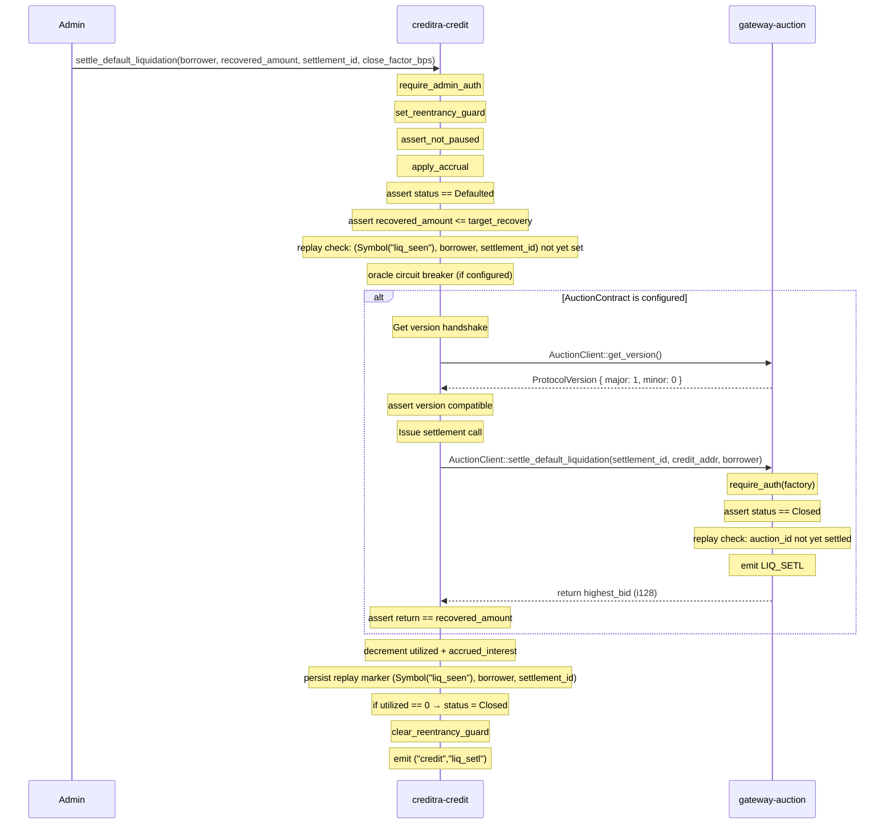
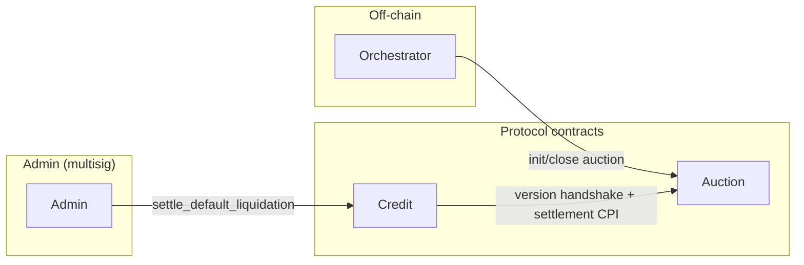

# Cross-Contract Handshake Protocol

**Version:** 1.0
**Status:** Authoritative for `main` at the time of writing
**Scope:** `creditra-credit` (`contracts/credit/`), `gateway-auction` (`gateway-contract/contracts/auction_contract/`)
**Last updated:** 2026-07-28

---

## 1. Purpose

The credit contract and the auction contract communicate through a minimal,
versioned cross-contract handshake protocol. This document defines the wire
interface, version negotiation, replay protection, reentrancy safety, and
error boundaries that govern that communication.

The handshake serves two goals:

1. **Protocol compatibility** — Both contracts agree on a shared version before
   exchanging data, preventing silent misalignment after upgrades.
2. **Atomic settlement** — The credit contract delegates liquidation settlement
   to the auction contract and asserts the returned value, making the combined
   operation atomic from the caller's perspective.

---

## 1.1 Call Flow Diagram

```
┌─────────────────────────────────────────────────────────────────────────────┐
│ CREDIT CONTRACT                                                             │
│                                                                             │
│  settle_default_liquidation(                                               │
│    borrower: Address,                                                      │
│    recovered_amount: i128,        ← Admin supplies expected recovery      │
│    settlement_id: Symbol,         ← Unique settlement marker              │
│    close_factor_bps: u32,        ← Liquidation cap (0-10000 bps)         │
│    oracle_price: Option<i128>     ← Optional oracle price for gating      │
│  )                                                                          │
│                                                                             │
│  1. require_admin_auth()           — Only admin can initiate               │
│  2. set_reentrancy_guard()         — Prevent nested calls                  │
│  3. Validate oracle (if configured) — Price freshness check               │
│  4. Check: auction_contract is configured                                 │
│  5. Get version handshake                                                 │
│     │                                                                      │
│     └──→ [CPI] AuctionClient::get_version()                              │
│          └─→ Returns: ProtocolVersion { major: 1, minor: 0 }             │
│          └─→ Credit asserts: major == 1, minor >= 0                      │
│                                                                             │
│  6. Issue settlement call                                                 │
│     │                                                                      │
│     └──→ [CPI] AuctionClient::settle_default_liquidation(                │
│              auction_id: settlement_id,                                   │
│              credit_contract: env.current_contract_address(),            │
│              borrower: borrower                                           │
│          )                                                                │
│          │                                                                 │
│          └──→ [Inside Auction]                                            │
│               ├─ get_factory_contract() [== credit address]              │
│               ├─ require_auth(factory)                                    │
│               ├─ assert: credit_contract == factory                       │
│               ├─ Load: AuctionState(auction_id)                          │
│               ├─ assert: status == Closed                                 │
│               ├─ assert: NOT already settled                              │
│               ├─ Mark: LiquidationSettled(auction_id) = true              │
│               ├─ Emit: LIQ_SETL event                                     │
│               └─ Return: highest_bid (i128)                               │
│                                                                             │
│  7. Back in Credit:                                                        │
│     ├─ assert: auction_recovered == recovered_amount                      │
│     └─ if mismatch: panic(InvalidAmount) + clear_reentrancy_guard        │
│                                                                             │
│  8. Settle internal accounting                                             │
│     ├─ Allocate recovered_amount to accrued_interest first                │
│     ├─ Remainder → utilized_amount                                        │
│     ├─ Mark: LiquidationSettled(borrower, settlement_id) = true           │
│     └─ if utilized == 0: status → Closed                                  │
│                                                                             │
│  9. clear_reentrancy_guard()                                               │
│ 10. Emit: ("credit", "liq_setl") event                                    │
│                                                                             │
└─────────────────────────────────────────────────────────────────────────────┘

Legend:
  [CPI]  = Cross-Protocol Interface (cross-contract call)
  ├─     = Sequential step
  └─     = Final step in sequence
```

---

## 2. Protocol Version Negotiation

Both contracts expose a `get_version` function that returns a
[`ProtocolVersion`](../contracts/credit/src/handshake.rs) struct:

```rust
#[contracttype]
#[derive(Clone, Copy, Debug, PartialEq, Eq)]
pub struct ProtocolVersion {
    pub major: u32,
    pub minor: u32,
}
```

### Version rules

| Rule | Constraint | Rationale |
|------|-----------|-----------|
| **Major lock** | `current.major == remote.major` | Breaking changes (e.g. parameter reordering, removal) require a major bump. Contracts with different major versions are never compatible. |
| **Minor forward** | `remote.minor >= 0` (any) | Minor bumps add backward-compatible fields or entrypoints. A contract with a higher minor version can still interoperate with a peer at an older minor. |

### Verification entrypoint

The credit contract calls `AuctionClient::get_version()` at runtime before
issuing the settlement call. If the returned `ProtocolVersion` is
incompatible, the call reverts with `IncompatibleVersion` before any state
mutation occurs.

### Current version

| Contract | `major` | `minor` |
|----------|---------|---------|
| `creditra-credit` | 1 | 0 |
| `gateway-auction` | 1 | 0 |

Implementation reference: `contracts/credit/src/handshake.rs`,
`gateway-contract/contracts/auction_contract/src/...`.

---

## 3. Settlement Handshake

The core cross-contract flow is the default-liquidation settlement handshake
between the credit contract and the auction contract.

### 3.1 Sequence



### 3.2 Credit contract entrypoint

**Signature** (`contracts/credit/src/lib.rs`):

```rust
pub fn settle_default_liquidation(
    env: Env,
    borrower: Address,
    recovered_amount: i128,
    settlement_id: Symbol,
    close_factor_bps: u32,
) -> Result<(), ContractError>
```

**Preconditions** (all must hold, in order):

1. Caller is the contract admin (`require_admin`).
2. Reentrancy guard is not set.
3. Contract is not paused.
4. `apply_accrual(env, &borrower)` has been run (caller must invoke before).
5. Credit line status is `Defaulted`.
6. `recovered_amount > 0` and `recovered_amount <= target_recovery` where
   `target_recovery = utilized * close_factor_bps / 10_000`.
7. `close_factor_bps` is between 1 and `max_close_factor_bps`
   (defaults to `10_000`; configurable via `set_max_close_factor_bps`).
8. Settlement replay ID `(Symbol("liq_seen"), borrower, settlement_id)` does
   not exist in persistent storage.
9. Oracle circuit-breaker (if configured): the stored oracle price is within
   deviation and not stale.

**Cross-contract call** (only if `AuctionContract` address is set):

```rust
// Version handshake
let remote_version = auction_client.get_version();
assert!(handshake::verify_version(&env, remote_version), "Incompatible Version");

// Settlement call with return-value assertion
let auction_recovered = auction_client.settle_default_liquidation(
    &settlement_id,
    &env.current_contract_address(),
    &borrower,
);
assert!(auction_recovered == recovered_amount, "Amount mismatch");
```

### 3.3 Auction contract entrypoint

**Signature** (`gateway-contract/contracts/auction_contract/src/lib.rs`):

```rust
pub fn settle_default_liquidation(
    env: Env,
    auction_id: Symbol,
    credit_contract: Address,
    borrower: Address,
) -> i128
```

**Preconditions**:

1. Factory contract is configured.
2. Caller is the registered factory contract (the credit contract).
3. Auction with `auction_id` exists and its status is `Closed`.
4. Auction has not been previously settled (one-time per `auction_id`).

**Effects**:

- Marks the auction as settled (replay protection via persistent marker).
- Emits `LIQ_SETL` / `auction` event with `(auction_id, credit_contract, borrower, winner, recovered_amount)`.
- Returns `highest_bid` (i128) to the caller.

**Errors**:

| Error discriminant | Condition |
|--------------------|-----------|
| `NoFactoryContract` | Factory address not set |
| `Unauthorized` | Caller does not match factory |
| `NotFound` | Auction ID not found |
| `NotClosed` | Auction status is not `Closed` |
| `AlreadySettled` | Auction has been settled |

---

## 4. Replay Protection

Settlement replay is prevented on **both sides** of the handshake:

| Contract | Dedup Key | Storage Primitive | Scope |
|----------|-----------|-------------------|-------|
| Credit | `(Symbol("liq_seen"), Address(borrower), Symbol(settlement_id))` | Persistent storage `has` / `set` | Per-borrower, per-settlement |
| Auction | `(Symbol("settled"), Symbol(auction_id))` | Persistent storage `has` / `set` | Per-auction |

A settlement call is idempotent from the protocol's perspective — the replay
marker is written **during** the successful call, so replaying the same
`(borrower, settlement_id)` or same `auction_id` reverts before any state
is re-mutated.

---

## 5. Reentrancy Safety

The credit contract's `settle_default_liquidation` is protected by the
contract-wide reentrancy guard (`Symbol("reentrancy")` instance flag).
The guard is set before any external call and cleared after all external
calls complete:

```text
set_reentrancy_guard → [oracle, version check, auction CPI] → clear_reentrancy_guard
```

The auction contract's `settle_default_liquidation` does **not** perform
outbound token transfers, so it cannot be used as a reentrancy vector.
(`place_bid` does set a reentrancy guard for its refund path, but
`settle_default_liquidation` is outside that scope.)

---

## 6. Detailed Error Mapping

### 6.1 Errors Crossing the Boundary (Auction → Credit)

When the credit contract calls the auction contract, errors from the auction
can surface to the caller. Depending on the error, the behavior differs:

| Auction Error | Code | Credit Result | Severity | Handling |
|---------------|------|---------------|----------|----------|
| `NoFactoryContract` | 4 | Panic with audit event | Fatal | Indicates misconfiguration; block all settlements until fixed |
| `Unauthorized` | 5 | Panic with audit event | Fatal | Caller does not match factory; check auction config |
| `NotFound` | 12 | Panic with audit event | Fatal | Auction ID doesn't exist; verify settlement ID is correct |
| `NotClosed` | 3 | Panic with audit event | Fatal | Auction still open; auction lifecycle incomplete |
| `AlreadySettled` | 13 | Panic with audit event | Fatal | Auction already settled; replay attempted |

**Credit contract's response**: All auction errors cause the credit contract's
`settle_default_liquidation` to panic, reverting the entire transaction (including
reentrancy guard cleanup via `clear_reentrancy_guard()` in the `finally` path).

**Caller's responsibility**: Off-chain orchestration must verify auction state
before calling `settle_default_liquidation`. The handshake is designed to fail-fast
rather than partial-succeed.

### 6.2 Errors Originating in Credit

Errors that originate in the credit contract are not directly transmitted to the
auction. Instead, they are handled internally:

| Error | Code | Trigger | Handling |
|-------|------|---------|----------|
| `InvalidAmount` | 5 | Auction-returned amount ≠ caller-supplied `recovered_amount` | Clear guard, panic, audit event |
| `OraclePriceInvalid` | 36 | Price is ≤ 0 or missing when required | Clear guard, panic, circuit breaker logs |
| `OraclePriceStale` | 37 | Price age exceeds `max_age_seconds` | Clear guard, panic, circuit breaker logs |
| `OraclePriceDeviation` | 38 | Price change exceeds `max_deviation_bps` | Clear guard, panic, circuit breaker logs |
| `Reentrancy` | 11 | Guard already set (nested call detected) | Panic immediately, no state change |

### 6.3 Fatal vs. Recoverable

- **Fatal errors** (all cross-boundary errors): Transaction reverts in full.
  No state is persisted. The admin must investigate and fix the root cause.
- **Recoverable errors** (within credit): Rare; primarily oracle circuit-breaker.
  If the oracle price is stale, the admin can call `submit_oracle_prices` to
  refresh and retry.

### 6.4 Error Boundary Guarantees

**Atomic success or full failure**:
- If `settle_default_liquidation` completes without panic, all state changes
  (replay markers, debt reduction, status transition) are persisted.
- If any step reverts (including auction errors, oracle validation, or amount
  mismatch), the entire transaction is rolled back and the reentrancy guard is
  cleared.

---

## 7. Security Assumptions & Guarantees

### 7.1 Authentication Model

| Function | Caller | Verification |
|----------|--------|---------------|
| `Credit::settle_default_liquidation` | Admin only | `require_admin_auth()` at entry |
| `Auction::settle_default_liquidation` | Credit contract | `require_auth(factory)` + identity check `credit_contract == factory` |

**Key insight**: The auction does not directly verify the caller is the credit
contract. Instead, it verifies:
1. The caller is authorized by the factory (credit) contract.
2. The `credit_contract` parameter matches the factory.

This creates an **identity verification chain** that prevents unauthorized
settlement if the factory is compromised.

### 7.2 State Mutation Ordering (Checks-Effects-Interactions)

**Credit contract**:
1. **Checks**: Verify admin auth, credit line status, oracle, reentrancy guard.
2. **Effects**: Set reentrancy guard, version check, issue CPI.
3. **Interactions**: Call auction, receive result, validate.
4. **Final effects**: Persist replay marker, update debt, clear guard.

The reentrancy guard wraps the entire settlement flow, ensuring no re-entrance
during:
- Cross-contract calls to the auction
- Future oracle CPIs (if implemented)

**Auction contract**:
1. **Checks**: Verify factory auth, auction exists, status is Closed, not settled.
2. **Effects**: Mark as settled (replay protection).
3. **Return**: Highest bid to caller (no token transfer from auction).

### 7.3 No Unwrap() in Production Paths

**Credit contract**: All unwraps are in test setup or non-critical initialization.
Production settlement paths use `unwrap_or_else` with explicit error handling.

Example:
```rust
let price = oracle_price.unwrap_or_else(|| {
    clear_reentrancy_guard(&env);
    env.panic_with_error(ContractError::OraclePriceInvalid)
});
```

**Auction contract**: Similar pattern with `unwrap_or_else` for factory retrieval.

### 7.4 Overflow-Safe Math

Both contracts use Soroban SDK math primitives:
- `checked_add`, `checked_mul` for complex calculations (interest accrual, deviation).
- `saturating_sub` for timestamps (prevents underflow on age calculation).

No unsafe raw arithmetic in settlement paths.

### 7.5 What Each Contract Trusts

| Contract | Trusts | Basis | Limit |
|----------|--------|-------|-------|
| **Credit** | Auction returns correct `highest_bid` | Auction is owned by protocol team | Asserts return value matches caller supply |
| **Auction** | Credit's identity (`require_auth`) | Soroban SDK's `require_auth` | Cannot be spoofed across network |
| **Both** | Admin is honest | Admin is multisig | Reentrancy guard blocks re-entrance during settlement |

### 7.6 Invariants Maintained

1. **Non-negative debt**: `utilized_amount ≥ 0` after settlement.
2. **Accrued ≤ Utilized**: `accrued_interest ≤ utilized_amount` at all times.
3. **Replay protection**: Settlement with same `(borrower, settlement_id)` and `auction_id` can only succeed once per pair.
4. **Status consistency**: After full settlement (recovered == utilized), credit line transitions to `Closed`.
5. **Guard consistency**: Reentrancy guard is always cleared on function exit (success or panic).

---

## 8. Trust Boundaries



- **Credit** trusts `Auction` only to return the correct `highest_bid`.
  The credit contract asserts that the returned value matches the caller-supplied
  `recovered_amount`. No token transfer authority is delegated.
- **Auction** trusts `Credit` by verifying the caller is the registered factory
  contract (`require_auth`). No other address can trigger settlement.
- **Off-chain orchestrator** runs the auction lifecycle but cannot settle —
  only the admin can call the credit contract's `settle_default_liquidation`.

---

## 9. Error Taxonomy

| Error | Origin | Meaning |
|-------|--------|---------|
| `IncompatibleVersion` | Credit `handshake::verify_version` | Auction contract version does not match credit's protocol version. |
| `ReentrantCall` | Credit reentrancy guard | `settle_default_liquidation` called while guard is set. |
| `InvalidAmount` | Credit after CPI | Amount returned by auction does not equal `recovered_amount`. |
| `AlreadySettled` | Auction | Auction has already been settled — one-time per `auction_id`. |
| `AuctionError::NotClosed` | Auction | Settlement attempted while auction is still open. |
| `AuctionError::Unauthorized` | Auction `require_auth` | Caller is not the registered factory contract. |

---

## 10. Adding or Changing a Handshake

When modifying the handshake interface, follow these rules:

1. **Backward-compatible change** (new field appended to existing entrypoint,
   new entrypoint added): bump `minor`.
2. **Breaking change** (parameter removal/reorder, semantic change,
   removal of replay protection): bump `major`.
3. **Both contracts must be upgraded together** for a breaking change.
   The old and new credit contracts cannot interoperate with mismatched
   major versions.
4. **Update this document** in the same PR. Bump the version header.

---

## 11. References

- `contracts/credit/src/handshake.rs` — version struct, `verify_version`, `get_current_version`
- `contracts/credit/src/lib.rs` — `AuctionClient` trait, `settle_default_liquidation` entrypoint (lines ~1826-1900)
- `gateway-contract/contracts/auction_contract/src/lib.rs` — `settle_default_liquidation` entrypoint (lines ~502-540)
- `docs/default-liquidation-auction-hook.md` — interface definition between credit and auction contracts
- `docs/ARCHITECTURE.md` — §5 default/auction/settlement sequence, §8 cross-contract call topology
- `docs/state-machine.md` — Defaulted → Closed transition via settlement
