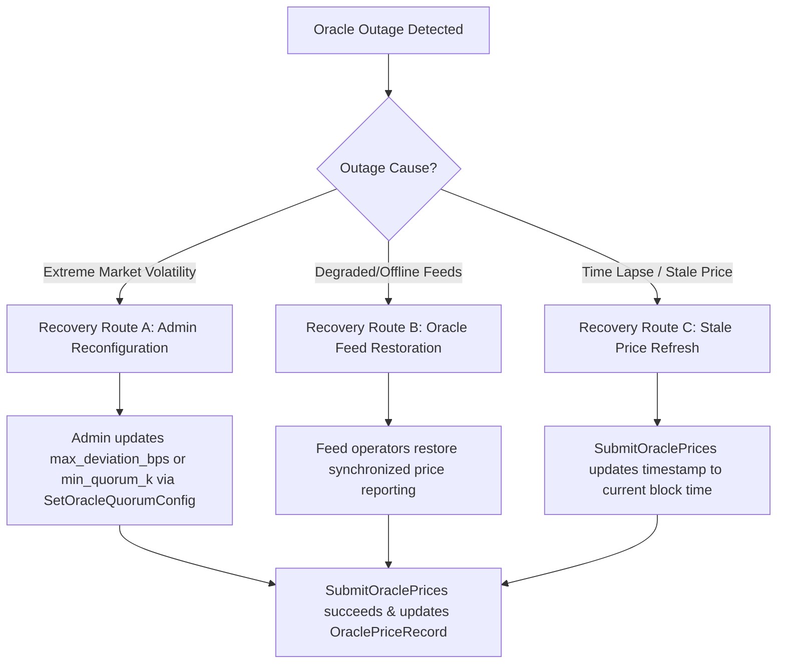

# Multi-Oracle Outage Simulation & Recovery Guidelines (`creditra-credit`)

## Overview

The CosmWasm `creditra-credit` smart contract implements a quorum-of-K sliding window price resolution algorithm (`oracles::resolve_quorum_price`) to combine $N$ independent price feeds into a single canonical price record (`OraclePriceRecord`).

This document details oracle outage conditions, authorization controls, price staleness tracking, and three distinct recovery workflows verified by end-to-end simulation tests in [`contracts/creditra-credit/tests/e2e_outage.rs`](file:///c:/Users/cisat/Creditra-Contracts/contracts/creditra-credit/tests/e2e_outage.rs).

---

## Quorum Price Resolution Architecture

Given $N$ submitted prices and an active `OracleQuorumConfig` ($K$, `max_deviation_bps`, `max_age_seconds`):

1. **Validation**: All prices must be strictly positive ($p_i > 0$) and $N \le 20$ (`MAX_ORACLE_FEEDS`).
2. **Sorting**: Prices are sorted in ascending order.
3. **Sliding Window**: A K-wide window slides over the sorted array.
4. **Deviation Bounds Check**: The spread between highest ($P_{hi}$) and lowest ($P_{lo}$) elements in the window must satisfy:
   $$\text{deviation\_bps} = \frac{|P_{hi} - P_{lo}| \cdot 10,000}{P_{lo}} \le \text{max\_deviation\_bps}$$
5. **Lower Median**: Returns the lower-median of the first qualifying window.
6. **Error Handling**:
   - `OracleQuorumNotMet`: Returned if $N < K$, $K < 2$, or no K-wide window satisfies the deviation bound.
   - `OraclePriceInvalid`: Returned if $N = 0$, $N > 20$, any $p_i \le 0$, or if quorum config is uninitialized.

---

## Oracle Outage Modes

### 1. Excessive Price Deviation Outage
During sudden market volatility or oracle feed manipulation, feed prices diverge significantly across feeds. When no window of $K$ prices agrees within `max_deviation_bps`, `SubmitOraclePrices` fails with `ContractError::OracleQuorumNotMet`.

### 2. Feed Offline / Insufficient Submissions Outage
When external infrastructure failures result in fewer than $K$ operational feeds submitting prices ($N < K$), `SubmitOraclePrices` fails with `ContractError::OracleQuorumNotMet`.

### 3. Feed Corruption Outage
When a feed returns erroneous non-positive prices ($\le 0$) or malformed output, `SubmitOraclePrices` fails with `ContractError::OraclePriceInvalid`.

### 4. Stale Price Outage
When the elapsed time since the last canonical price update exceeds `max_age_seconds` ($\text{current\_timestamp} - \text{record.timestamp} > \text{max\_age\_seconds}$), `is_price_stale` evaluates to `true`.

---

## Outage Recovery Workflows

### Recovery Route A: Admin Parameter Reconfiguration
If high market volatility causes price spreads to temporarily exceed default deviation limits (e.g. 5%), governance can adjust `max_deviation_bps` via `ExecuteMsg::SetOracleQuorumConfig` (e.g. widening from 500 bps to 2000 bps). Submitting prices under the updated configuration succeeds immediately.

### Recovery Route B: Oracle Feed Restoration
If an outage occurred due to offline or corrupted feed infrastructure, feed operators restore healthy price streams. Once $K$ feeds report within `max_deviation_bps`, price submissions resume automatically.

### Recovery Route C: Stale Price Refresh
For stale price states resulting from elapsed time, submitting fresh oracle prices updates `OraclePriceRecord.timestamp` to `env.block.time.seconds()`, returning the contract to a fresh state.

---

## Security & State Isolation Properties

- **Authorization Protection**: `SetOracleQuorumConfig` and `SubmitOraclePrices` require owner authorization (`info.sender == config.owner`). Non-owner calls fail with `ContractError::Unauthorized`.
- **State Preservation**: Failed price submission attempts leave pre-existing `OraclePriceRecord` values intact without state corruption.
- **System Isolation**: Existing credit lines, active draws, audit trails, proof-of-reserve queries, and health factor calculations remain isolated and operational during an oracle outage.
