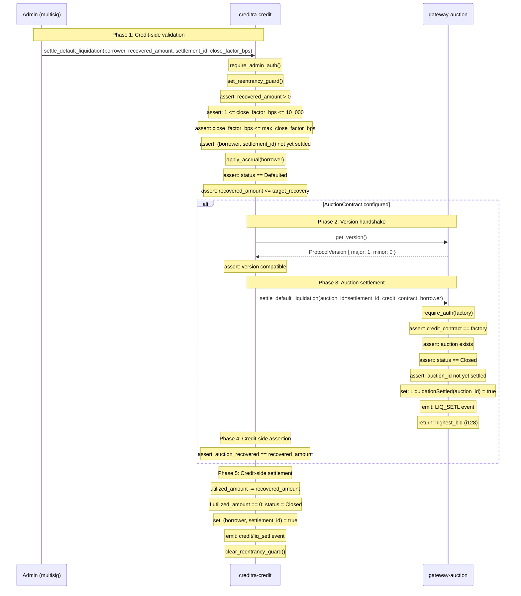

# Cross-Contract Settlement Contract

**Version:** 1.0  
**Status:** Authoritative for `main` at the time of writing  
**Scope:** `creditra-credit` (`contracts/credit/`), `gateway-auction` (`gateway-contract/contracts/auction_contract/`)  
**Last updated:** 2026-07-29

---

## 1. Purpose

This document formalizes the bilateral contract between the credit contract and the auction contract for default-liquidation settlement. It specifies the exact invariants, pre-conditions, post-conditions, return-value semantics, and replay-protection symmetry that govern the two-sided replay barrier formed by `settle_default_liquidation` on both contracts.

The settlement handshake is a **two-phase commit** where:
1. The credit contract initiates settlement with an expected `recovered_amount`
2. The auction contract validates the auction state and returns its `highest_bid`
3. The credit contract asserts the returned value matches the expected amount before persisting state

This design ensures atomicity: either both contracts settle consistently, or neither does.

---

## 2. Sequence Diagram



---

## 3. Formal Contract Specification

### 3.1 Credit Contract: `settle_default_liquidation`

**Signature:**
```rust
pub fn settle_default_liquidation(
    env: Env,
    borrower: Address,
    recovered_amount: i128,
    settlement_id: Symbol,
    close_factor_bps: u32,
)
```

**Pre-conditions (all must hold):**

| # | Condition | Rationale |
|---|-----------|-----------|
| C1 | `caller == admin` | Only authorized admin can trigger settlement |
| C2 | `recovered_amount > 0` | Zero recovery is invalid accounting |
| C3 | `1 <= close_factor_bps <= 10_000` | Close factor must be valid basis points |
| C4 | `close_factor_bps <= max_close_factor_bps` | Protocol-level cap on recovery percentage |
| C5 | `!has((borrower, settlement_id))` | Replay protection: prevent duplicate settlement |
| C6 | `status == Defaulted` | Can only settle defaulted credit lines |
| C7 | `recovered_amount <= target_recovery` | Cannot recover more than close factor allows |
| C8 | `reentrancy_guard == false` | Prevent re-entrant calls |

**Where:**
- `target_recovery = utilized_amount * close_factor_bps / 10_000`
- `max_close_factor_bps` is configured via `set_max_close_factor_bps` (default: 10_000)

**Cross-contract call (if AuctionContract configured):**

| # | Operation | Assertion |
|---|-----------|-----------|
| X1 | `auction_client.get_version()` | `remote.major == 1 && remote.minor >= 0` |
| X2 | `auction_client.settle_default_liquidation(settlement_id, credit_addr, borrower)` | Returns `auction_recovered` |
| X3 | `auction_recovered == recovered_amount` | Panic with `InvalidAmount` if mismatch |

**Post-conditions (on success):**

| # | Condition | Persistence |
|---|-----------|-------------|
| P1 | `utilized_amount' = utilized_amount - recovered_amount` | Persistent storage |
| P2 | `accrued_interest' = min(accrued_interest, utilized_amount')` | Persistent storage |
| P3 | `status' = Closed` if `utilized_amount' == 0` else `status' = Defaulted` | Persistent storage |
| P4 | `has((borrower, settlement_id)) = true` | Persistent storage (replay marker) |
| P5 | `reentrancy_guard' = false` | Instance storage |
| P6 | Event `credit/liq_setl` emitted | Event log |
| P7 | Event `credit/closed` emitted (if status transitioned) | Event log |

**Error conditions:**

| Error | Condition | Severity |
|-------|-----------|----------|
| `InvalidAmount` | C2, C3, C4, or X3 violated | Fatal |
| `OverLimit` | C4 violated | Fatal |
| `AlreadyInitialized` | C5 violated | Fatal |
| `CreditLineNotFound` | Borrower not found | Fatal |
| `CreditLineDefaulted` | C6 violated | Fatal |
| `Reentrancy` | C8 violated | Fatal |
| `IncompatibleVersion` | X1 violated | Fatal |

---

### 3.2 Auction Contract: `settle_default_liquidation`

**Signature:**
```rust
pub fn settle_default_liquidation(
    env: Env,
    auction_id: Symbol,
    credit_contract: Address,
    borrower: Address,
) -> i128
```

**Pre-conditions (all must hold):**

| # | Condition | Rationale |
|---|-----------|-----------|
| A1 | `factory_contract is configured` | Must know who authorized caller |
| A2 | `require_auth(factory_contract)` succeeds | Caller must be authorized by factory |
| A3 | `credit_contract == factory_contract` | Dual-layer identity verification |
| A4 | `has(auction_id)` | Auction must exist |
| A5 | `auction.status == Closed` | Can only settle closed auctions |
| A6 | `!has(LiquidationSettled(auction_id))` | Replay protection: one-time settlement |

**Post-conditions (on success):**

| # | Condition | Persistence |
|---|-----------|-------------|
| AP1 | `has(LiquidationSettled(auction_id)) = true` | Persistent storage (replay marker) |
| AP2 | Event `LIQ_SETL/auction` emitted with `(auction_id, credit_contract, borrower, winner, highest_bid)` | Event log |
| AP3 | If `bid_token configured && highest_bid > 0`: transfer `highest_bid` from auction to `credit_contract` | Token contract |
| AP4 | Return `highest_bid` (i128) | Return value |

**Error conditions:**

| Error | Condition | Severity |
|-------|-----------|----------|
| `NoFactoryContract` | A1 violated | Fatal |
| `Unauthorized` | A2 or A3 violated | Fatal |
| `NotFound` | A4 violated | Fatal |
| `NotClosed` | A5 violated | Fatal |
| `AlreadySettled` | A6 violated | Fatal |

---

## 4. Bilateral Invariants

The following invariants must hold across both contracts after a successful settlement:

### 4.1 Amount Consistency Invariant

**Invariant:** `recovered_amount (credit) == highest_bid (auction)`

**Enforcement:**
- Credit contract asserts: `auction_recovered == recovered_amount` (X3)
- If violated, credit contract panics with `InvalidAmount` before persisting state
- This ensures the amount recorded on both sides is identical

**Rationale:** Prevents accounting divergence between credit debt reduction and auction proceeds.

### 4.2 Replay Protection Symmetry

**Invariant:** Settlement with the same identifiers can succeed at most once on each contract.

**Credit-side dedup key:** `(Symbol("liq_seen"), borrower, settlement_id)`  
**Auction-side dedup key:** `(Symbol("settled"), auction_id)` where `auction_id == settlement_id`

**Enforcement:**
- Credit: Check C5 before any state mutation
- Auction: Check A6 before any state mutation
- Both write markers **during** successful execution (P4, AP1)

**Symmetry property:** If either side rejects replay, the entire transaction reverts, ensuring both sides remain in sync.

### 4.3 Identity Verification Chain

**Invariant:** Only the authorized credit contract can trigger auction settlement.

**Enforcement chain:**
1. Credit admin calls `settle_default_liquidation` (C1)
2. Credit calls auction with `credit_contract = env.current_contract_address()`
3. Auction verifies `require_auth(factory)` (A2)
4. Auction verifies `credit_contract == factory` (A3)

**Rationale:** Creates a two-factor identity check that prevents spoofed settlement calls.

### 4.4 Status Consistency

**Invariant:** Credit line status transitions to `Closed` iff full debt is recovered.

**Condition:** `status' = Closed` ⇔ `utilized_amount' == 0`

**Enforcement:**
- Credit contract checks `utilized_amount' == 0` before transitioning (P3)
- Partial settlements keep status as `Defaulted`
- Full settlement transitions to `Closed`

---

## 5. Return-Value Semantics

### 5.1 Auction Contract Return Value

**Returns:** `highest_bid: i128`

**Semantics:**
- The winning bid amount from the auction
- May be `0` if no valid bids were placed
- Must exactly match the credit contract's `recovered_amount` parameter

**Usage by credit contract:**
```rust
let auction_recovered = auction_client.settle_default_liquidation(
    &settlement_id,
    &env.current_contract_address(),
    &borrower,
);
assert!(auction_recovered == recovered_amount, "InvalidAmount");
```

### 5.2 Credit Contract Return Value

**Returns:** `()` (unit)

**Semantics:**
- Success is indicated by lack of panic
- State changes are persisted atomically
- Events are emitted for off-chain indexing

---

## 6. Replay Protection Symmetry

The replay protection mechanism is symmetric across both contracts:

| Aspect | Credit Contract | Auction Contract |
|--------|----------------|------------------|
| **Deduplication key** | `(borrower, settlement_id)` | `auction_id` |
| **Storage tier** | Persistent | Persistent |
| **Check timing** | Before any state mutation (C5) | Before any state mutation (A6) |
| **Write timing** | After successful settlement (P4) | After successful settlement (AP1) |
| **Error on replay** | `AlreadyInitialized` | `AlreadySettled` |
| **Recovery** | Transaction revert | Transaction revert |

**Symmetry guarantee:** If either side detects a replay attempt, the entire cross-contract call reverts, ensuring both contracts maintain consistent replay state.

**Mapping between keys:** The `settlement_id` parameter passed to the credit contract is used as the `auction_id` parameter when calling the auction contract. This creates a 1:1 mapping between the two deduplication keys.

---

## 7. Error Propagation and Atomicity

### 7.1 Error Propagation

| Origin | Error | Credit Response | Auction Response |
|--------|-------|-----------------|------------------|
| Credit pre-check | Any (C1-C8) | Panic, revert | N/A (not called) |
| Credit version check | `IncompatibleVersion` | Panic, revert | N/A |
| Auction pre-check | Any (A1-A6) | Panic, revert | Panic, revert |
| Amount mismatch | `InvalidAmount` (X3) | Panic, revert | N/A (already returned) |

### 7.2 Atomicity Guarantees

**All-or-nothing semantics:**
- If any condition fails on either contract, the entire transaction reverts
- No partial state is persisted
- Reentrancy guard is always cleared (via `finally` path in credit contract)

**Rollback scenarios:**
1. Credit pre-check fails → No auction call, credit state unchanged
2. Version mismatch → No auction call, credit state unchanged
3. Auction pre-check fails → Credit state unchanged, auction state unchanged
4. Amount mismatch → Credit state unchanged, auction state already mutated but transaction reverts

**Note on scenario 4:** If the auction contract has already written its replay marker (AP1) but the credit contract detects an amount mismatch (X3), the transaction reverts and the auction's replay marker is rolled back. This is safe because the replay marker is written in the same transaction.

---

## 8. Security Assumptions

### 8.1 Trust Model

| Contract | Trusts | Basis |
|----------|--------|-------|
| Credit | Auction returns correct `highest_bid` | Asserts return value matches admin input |
| Auction | Credit identity via `require_auth` | Soroban SDK cryptographic auth |
| Both | Admin is honest | Admin is multisig |

### 8.2 Reentrancy Safety

- Credit contract sets reentrancy guard before auction call (C8)
- Auction contract sets reentrancy guard only during token transfer (if applicable)
- Both guards are cleared after operations complete
- No re-entrance path exists from auction → credit (credit does not expose callable entrypoints during settlement)

### 8.3 Overflow Safety

- Both contracts use `checked_*` arithmetic for all accounting operations
- `saturating_sub` for timestamp calculations
- Release profile sets `overflow-checks = true`

---

## 9. References

- [`docs/CROSS_CONTRACT_HANDSHAKE.md`](./CROSS_CONTRACT_HANDSHAKE.md) — Full protocol specification with version negotiation
- [`docs/default-liquidation-auction-hook.md`](./default-liquidation-auction-hook.md) — Interface definition and trust boundaries
- [`docs/ARCHITECTURE.md`](./ARCHITECTURE.md) — Sequence diagrams and call topology
- [`docs/state-machine.md`](./state-machine.md) — Credit line state transitions
- `contracts/credit/src/lifecycle.rs` — Credit-side implementation
- `gateway-contract/contracts/auction_contract/src/lib.rs` — Auction-side implementation
