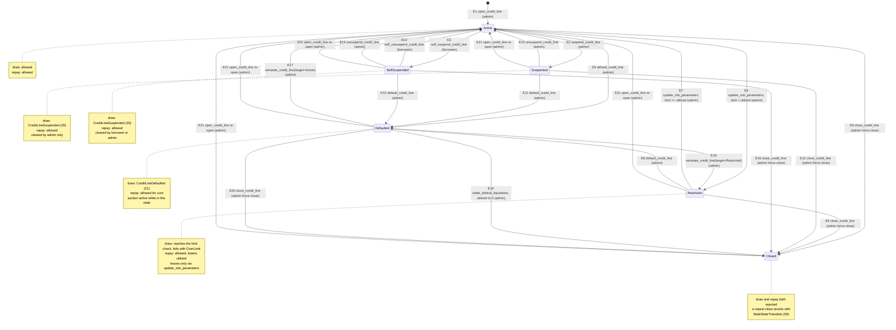
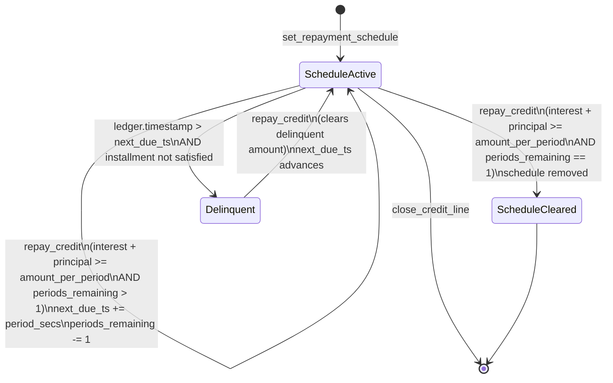

# Credit-Line State Machine

The authoritative reference for the `CreditStatus` state machine of the
`creditra-credit` Soroban contract, and for the instalment repayment schedule
that rides alongside it.

Every edge below is derived from the `require_valid_transition` call sites in
`contracts/credit/src/lifecycle.rs` and the status writes in
`contracts/credit/src/risk.rs`. Nothing here is hand-maintained from memory:
`contracts/credit/tests/state_transition_invariants.rs` asserts the same matrix
the tables describe.

---

## Part 1 — `CreditStatus` lifecycle

### 1.1 States

`CreditStatus` is a `#[contracttype]` `#[repr(u32)]` enum declared in
`contracts/credit/src/types.rs`. Its discriminants are ABI-stable.

| Discriminant | Variant | Draw | Repay | Meaning |
|---|---|:---:|:---:|---|
| `0` | `Active` | yes | yes | Healthy line. The only state in which a new line starts and the only state a suspension can originate from. |
| `1` | `Suspended` | blocked | yes | Admin-initiated hold. Draws blocked, repayments accepted, interest keeps accruing. |
| `2` | `Defaulted` | blocked | yes | In default. Draws blocked, cure by repayment, exit via `reinstate_credit_line` or settlement. |
| `3` | `Closed` | blocked | **blocked** | Terminal. The line is never reopened in place; a fresh line is opened with `open_credit_line`. |
| `4` | `Restricted` | numeric check | yes | The limit was cut below the outstanding balance. Draws still reach the numeric limit check but fail with `OverLimit` until the line is cured. |
| `5` | `SelfSuspended` | blocked | yes | Borrower-initiated hold. Same draw/repay semantics as `Suspended`, but the borrower may lift it without the admin. |

Draw gating lives in `borrow::draw_status_error`; repayment is refused only for
`Closed` (`lib.rs::repay_credit`).

> `Restricted` is deliberately *not* a hard draw block. It reaches the numeric
> limit check so a line that has been cured past its new limit starts drawing
> again without needing a separate state write, while a line still over its
> limit cannot create new borrowing. See
> `docs/utilization-cap.md`.

### 1.2 Actors

| Actor | How it is established | What it may drive |
|---|---|---|
| **Admin** | Address stored in instance storage by `init`; rotated via `propose_admin` / `accept_admin`. | `open_credit_line`, `suspend_credit_line`, `unsuspend_credit_line`, `default_credit_line`, `reinstate_credit_line`, `close_credit_line`, `update_risk_parameters` |
| **Borrower** | The `borrower` address on the credit line; must `require_auth()`. | `self_suspend_credit_line`, `self_unsuspend_credit_line`, `close_credit_line` (only at zero balance), `repay_credit` |
| **Liquidation settlement** | Admin/orchestrator calling `settle_default_liquidation` after an auction closes. | `Defaulted → Closed` when the recovered amount zeroes the balance |
| **Nobody** | — | `Closed` is terminal for in-place mutation |

Admin auth is enforced in the `lib.rs` `#[contractimpl]` wrappers, not in the
`lifecycle.rs` functions, so that each invocation issues exactly one
`require_auth` for the same address (Soroban rejects a duplicate auth frame).
`self_suspend_credit_line` enforces `borrower.require_auth()` itself.

### 1.3 Edges

Every edge names the entrypoint that performs it and the actor that may call
it. "Any non-`Closed`" is the literal source set in the code.

| # | From | To | Entrypoint | Actor | Precondition beyond the source state |
|---|---|---|---|---|---|
| E1 | *(none)* | `Active` | `open_credit_line` | Admin | `credit_limit > 0`, within `[min_limit, max_limit]` |
| E2 | `Active` | `Suspended` | `suspend_credit_line` | Admin | Protocol not paused |
| E3 | `Active` | `SelfSuspended` | `self_suspend_credit_line` | Borrower | Protocol not paused |
| E4 | `Active` | `Restricted` | `update_risk_parameters` | Admin | New `credit_limit < utilized_amount` |
| E5 | `Active` | `Defaulted` | `default_credit_line` | Admin | Liquidation grace window elapsed |
| E6 | `Active` | `Closed` | `close_credit_line` | Admin | none (force-close) |
| E7 | `Restricted` | `Active` | `update_risk_parameters` | Admin | New `credit_limit >= utilized_amount` (auto-cure) |
| E8 | `Restricted` | `Defaulted` | `default_credit_line` | Admin | Liquidation grace window elapsed |
| E9 | `Restricted` | `Closed` | `close_credit_line` | Admin | none (force-close) |
| E10 | `Suspended` | `Active` | `unsuspend_credit_line` | Admin | none |
| E11 | `Suspended` | `Defaulted` | `default_credit_line` | Admin | Liquidation grace window elapsed |
| E12 | `Suspended` | `Closed` | `close_credit_line` | Admin | none (force-close) |
| E13 | `SelfSuspended` | `Active` | `self_unsuspend_credit_line` | Borrower | none |
| E14 | `SelfSuspended` | `Active` | `unsuspend_credit_line` | Admin | none |
| E15 | `SelfSuspended` | `Defaulted` | `default_credit_line` | Admin | Liquidation grace window elapsed |
| E16 | `SelfSuspended` | `Closed` | `close_credit_line` | Admin | none (force-close) |
| E17 | `Defaulted` | `Active` | `reinstate_credit_line(target=Active)` | Admin | `target_status ∈ {Active, Restricted}` |
| E18 | `Defaulted` | `Restricted` | `reinstate_credit_line(target=Restricted)` | Admin | as E17 |
| E19 | `Defaulted` | `Closed` | `settle_default_liquidation` | Admin / orchestrator | `utilized_amount` reaches `0` after the recovery |
| E20 | `Defaulted` | `Closed` | `close_credit_line` | Admin | none (abandons the in-flight auction) |
| E21 | `Suspended`, `SelfSuspended`, `Defaulted`, `Restricted`, `Closed` | `Active` | `open_credit_line` (re-open) | Admin | Line is not already `Active`; the record is replaced with a fresh zero-balance line |

Notes that are easy to get wrong:

- **E7 is admin-driven, not borrower-driven.** Repaying in a `Restricted` line
  reduces `utilized_amount`; it does not flip the status. The flip happens on
  the admin's next `update_risk_parameters`, which is also where the limit is
  written. There is no borrower "cure" transition.
- **E10/E13/E14 are three distinct edges to the same target.** A borrower can
  only clear their own `SelfSuspended` (E13); a `Suspended` line created by the
  admin is cleared by the admin (E10). This least-privilege split is the reason
  `SelfSuspended` exists as a separate variant.
- **E17/E18 are the only exits from `Defaulted` other than close.** The
  suspension states cannot be reinstated into — a `Suspended` line is unsuspended
  (E10), not reinstated.
- **E21 is a replacement, not a transition.** `open_credit_line` writes a fresh
  `Active` record with `utilized_amount = 0`; it is admin-gated precisely so a
  borrower cannot self-suspend and then immediately re-activate.
- **Entering `Defaulted` increments the pending-auction counter, and every exit
  from it decrements.** E17, E18, E19, E20 and E21 all clear the counter
  atomically with the status write, so the fee-configuration freeze in
  `AuctionActive` (#63) can never observe a half-updated auction.

### 1.4 Diagram



### 1.5 Rejected edges

Since Issue #1146, a stale call is a typed error, not a silent success. Every
repeat of an edge above — `X → X` — reverts with
`ContractError::StaleStateTransition` (60, Lifecycle). Wrong-source calls revert
with the semantically correct existing code.

| Call | Source | Code |
|---|---|---|
| `suspend_credit_line` | `Suspended` or `SelfSuspended` (same origin) | `StaleStateTransition` (60) |
| `suspend_credit_line` | `Restricted` | `CreditLineSuspended` (20) |
| `suspend_credit_line` | `Defaulted` | `CreditLineDefaulted` (21) |
| `suspend_credit_line` | `Closed` | `CreditLineClosed` (4) |
| `self_suspend_credit_line` | `Suspended` (admin hold) | `CreditLineSuspended` (20) |
| `self_unsuspend_credit_line` | `Suspended` (admin hold) | `CreditLineSuspended` (20) |
| `self_unsuspend_credit_line` | `Restricted` | `CreditLineSuspended` (20) |
| `self_unsuspend_credit_line` | `Active` | `StaleStateTransition` (60) |
| `unsuspend_credit_line` | `Active` | `StaleStateTransition` (60) |
| `unsuspend_credit_line` | `Restricted` | `CreditLineSuspended` (20) |
| `unsuspend_credit_line` | `Defaulted` | `CreditLineDefaulted` (21) |
| `unsuspend_credit_line` | `Closed` | `CreditLineClosed` (4) |
| `default_credit_line` | `Defaulted` | `StaleStateTransition` (60) |
| `default_credit_line` | `Closed` | `CreditLineClosed` (4) |
| `reinstate_credit_line` | `Active` or `Restricted` with the same target | `StaleStateTransition` (60) |
| `reinstate_credit_line` | any target other than `Active` / `Restricted` | `InvalidAmount` (5) |
| `reinstate_credit_line` | `Restricted` with target `Active` | `CreditLineDefaulted` (21) |
| `reinstate_credit_line` | `Suspended` / `SelfSuspended` | `CreditLineDefaulted` (21) |
| `reinstate_credit_line` | `Closed` | `CreditLineClosed` (4) |
| `default_credit_line` | grace window still open (any default-eligible source) | `LiquidationGraceActive` (59) |
| `close_credit_line` | `Closed` | `StaleStateTransition` (60) |
| `close_credit_line` | borrower, `utilized_amount > 0` | `UtilizationNotZero` (10) |
| `close_credit_line` | any closer that is neither admin nor borrower | `Unauthorized` (1) |
| `open_credit_line` | line already `Active` | `AlreadyInitialized` (14) |
| `draw_credit` | `Suspended` / `SelfSuspended` | `CreditLineSuspended` (20) |
| `draw_credit` | `Defaulted` | `CreditLineDefaulted` (21) |
| `draw_credit` | `Closed` | `CreditLineClosed` (4) |
| `draw_credit` | `Restricted` with `utilized + amount > credit_limit` | `OverLimit` (6) |
| `repay_credit` | `Closed` | `CreditLineClosed` (4) |
| *any lifecycle entrypoint* | protocol paused | `Paused` (18) |

Full per-code semantics: [`docs/errors.md`](./errors.md).

### 1.6 Pre-flight view: `lifecycle_capabilities`

`lifecycle_capabilities(borrower)` is the read-only, no-auth bitmap a UI should
call before rendering transition buttons. Every field is `false` when the line
does not exist or the protocol is paused; otherwise it is derived purely from
the current `CreditStatus` (plus `utilized_amount == 0` for the borrower close).

| Field | `Active` | `Restricted` | `Suspended` | `SelfSuspended` | `Defaulted` | `Closed` |
|---|:---:|:---:|:---:|:---:|:---:|:---:|
| `can_suspend` | ✅ | ❌ | ❌ | ❌ | ❌ | ❌ |
| `can_self_suspend` | ✅ | ❌ | ❌ | ❌ | ❌ | ❌ |
| `can_close_admin` | ✅ | ✅ | ✅ | ✅ | ✅ | ❌ |
| `can_close_borrower` | ✅ if `utilized == 0` | ✅ if `utilized == 0` | ✅ if `utilized == 0` | ✅ if `utilized == 0` | ✅ if `utilized == 0` | ❌ |
| `can_default` | ✅ | ✅ | ✅ | ✅ | ❌ | ❌ |
| `can_reinstate` | ❌ | ❌ | ❌ | ❌ | ✅ | ❌ |

The bitmap mirrors the edge table exactly, with two known gaps that integrators
must not paper over:

- **E7 (`Restricted → Active`) and E21 (re-open) have no flag.** Both are driven
  by `update_risk_parameters` / `open_credit_line`, which are not among the five
  lifecycle entrypoints the bitmap covers. A client that needs to predict them
  must compare the stored `credit_limit` against `utilized_amount` itself.
- **E10 / E13 / E14 (unsuspend) have no flag.** `unsuspend_credit_line` and
  `self_unsuspend_credit_line` are deliberately excluded from the bitmap because
  their permission depends on the *actor*: the borrower can clear only
  `SelfSuspended`. Read the stored `CreditStatus` to decide which button to show.
- **E19 (settlement) has no flag.** It depends on the auction result, not on the
  credit line.

### 1.7 Invariants

Every transition preserves the accounting identity
`utilized_amount == principal + accrued_interest`, with all three non-negative,
and conserves the global `TotalUtilized` accumulator. The lifecycle functions
also obey:

- `apply_accrual` runs **before** any status write, so interest is materialised
  at the transition and never double-counted on a retry.
- `suspension_ts` is monotone non-decreasing; `assert_ts_monotonic` enforces it.
  `reinstate_credit_line` and the unsuspend paths reset it to `0`.
- `Defaulted → Closed` via settlement is idempotent per
  `(borrower, settlement_id)`; a replay returns `AlreadySettled` (51).
- Status writes go through `persist_credit_line(.., Some(previous_status))` so
  the `TotalUtilized` delta and the auction counter move in the same host
  transaction as the record.

### 1.8 Test coverage

| Concern | Test |
|---|---|
| Full edge matrix + accounting invariant at every checkpoint | `contracts/credit/tests/state_transition_invariants.rs::state_transition_matrix` |
| `Defaulted → Active` and `Defaulted → Restricted` reinstates, invalid targets | `state_transition_invariants.rs::reinstate_defaulted_to_active`, `::reinstate_defaulted_to_restricted`, `::reinstate_invalid_targets_revert` |
| Stale repeats, wrong-source calls, post-#1146 rejections | `contracts/credit/tests/stale_state_transitions.rs` |
| `Active ↔ SelfSuspended`, including the E13/E14 actor split | `contracts/credit/tests/borrower_self_suspend.rs` (`test_borrower_can_self_unsuspend_own_line`, `test_borrower_cannot_self_unsuspend_admin_suspension`, `test_admin_can_unsuspend_self_suspended_line`) |
| `Active ↔ Restricted` limit-decrease, auto-cure, and default-eligibility | `contracts/credit/tests/restricted_status.rs` |
| Suspend only from `Active`; reinstate only from `Defaulted` | `state_transition_invariants.rs::suspend_only_valid_from_active`, `::reinstate_only_valid_from_defaulted` |
| No double interest counting across suspend / reinstate | `state_transition_invariants.rs::debt_record_preserved_through_suspend_then_default`, `::no_double_interest_on_reinstate` |
| Capability bitmap per status | `contracts/lifecycle/tests/capabilities.rs` |
| Freeze / block interactions that gate draws independently of status | `contracts/credit/tests/freeze_draws.rs`, `::freeze_reason.rs`, `::circuit_breaker.rs` |

---

## Part 2 — Repayment schedule

The schedule attached by `set_repayment_schedule` is a **separate** state
machine. It governs `next_due_ts` and `periods_remaining`; it does not change
`CreditStatus` and is not gated by it.

| Field | Type | Meaning |
|---|---|---|
| `amount_per_period` | `i128` | Principal that must be retired each period |
| `next_due_ts` | `u64` | Unix timestamp of the next instalment due date |
| `period_secs` | `u64` | Duration of each period in seconds |
| `periods_remaining` | `u32` | How many instalments are still outstanding |

### 2.1 When `next_due_ts` advances

`next_due_ts` advances by exactly **one** `period_secs` when a `repay_credit`
call satisfies **both** of the following conditions simultaneously:

1. **All accrued interest is cleared** — the payment covers any outstanding
   interest before principal is counted.
2. **At least `amount_per_period` of principal is retired** in the same call.

If either condition is not met, `next_due_ts` remains unchanged regardless of
the repayment amount.

```text
let interest_cleared = repay_amount >= accrued_interest
let principal_paid   = repay_amount - min(repay_amount, accrued_interest)

if interest_cleared && principal_paid >= amount_per_period {
    next_due_ts     += period_secs
    periods_remaining -= 1
}
```

### 2.2 Interest-only repayment (Issue #503)

**Edge case:** when `repay_amount == accrued_interest` (interest-only), the
principal component is zero, which is strictly less than `amount_per_period`.
Therefore `next_due_ts` does **not** advance.

This is correct and intentional:

- An interest payment reduces the outstanding balance but does not satisfy the
  instalment obligation.
- Advancing the due date on an interest-only payment would let a borrower defer
  principal indefinitely with a stream of small interest payments.

| Time | Action | Repay amount | `next_due_ts` | Advances? |
|---|---|---|---|---|
| T0 + 15 days | Interest-only | ~8 219 | T0 + 30 days | **No** |
| T0 + 30 days | Interest + principal | ~16 438 + 100 000 | T0 + 60 days | **Yes** |

(for `credit_limit = 1_000_000`, `draw = 600_000`, `rate = 1_000` bps,
`amount_per_period = 100_000`, `period_secs = 2_592_000`)

Partial principal repayment (interest plus less than `amount_per_period`) also
does not advance the schedule. Even one stroop below the threshold is
insufficient.

### 2.3 Over-payment and exhaustion

A single `repay_credit` that retires two or more periods' worth of principal
advances the schedule by **exactly one period**. Surplus principal reduces the
outstanding balance but does not pre-pay future instalments.

When `periods_remaining` reaches zero after an advance, the schedule is
considered fully satisfied; `get_repayment_schedule` then returns `None` and
`is_delinquent` returns `false`.

`close_credit_line` clears the schedule, so a closed line carries no instalment
obligation.

### 2.4 Diagram



### 2.5 Test coverage

`contracts/credit/tests/installment_interest_only_repay.rs` and
`contracts/credit/tests/installment.rs` cover this machine; see
`docs/PROTOCOL_SPEC.md` for the `set_repayment_schedule` and `is_delinquent`
entrypoint specs.

---

## Related

- `contracts/credit/src/lifecycle.rs` — `require_valid_transition` and every
  transition function
- `contracts/credit/src/risk.rs` — `update_risk_parameters` (`Active ↔ Restricted`)
- `contracts/credit/src/borrow.rs` — `draw_status_error`, the draw gate
- `contracts/lifecycle/src/views.rs` — `lifecycle_capabilities` bitmap
- `contracts/credit/src/types.rs` — `CreditStatus`, `LifecycleCapabilities`
- [`docs/errors.md`](./errors.md) — canonical error reference
- [`docs/ARCHITECTURE.md`](./ARCHITECTURE.md) — sequence diagrams and call topology
- [`docs/PROTOCOL_SPEC.md`](./PROTOCOL_SPEC.md) — per-entrypoint validation order
